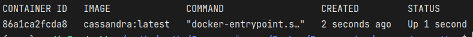

# Simple template for connecting Python to Cassandra

Instruction
------------

#### Clone repository

```shell
git clone https://github.com/vadushkin/cassandra-python-template.git
```

#### Change directory

```shell
cd cassandra-python-template
```

#### Commands:

```main.py```

```python
"""
Commands:

* docker run --name test-cassandra-v2 -p 9042:9042 -d cassandra:latest or docker-compose up -d --build
* docker exec -it test-cassandra-v2 bash
* cqlsh
* CREATE KEYSPACE employee WITH replication = {'class' : 'SimpleStrategy', 'replication_factor':2};
* USE employee;
* CREATE TABLE employee_details (id INT, age INT, city TEXT, name TEXT, PRIMARY KEY(id));

# and then run this python file
"""
from cassandra.cluster import Cluster

...
```

Run
---

#### Run Cassandra

```docker
docker-compose up -d --build
```

#### Go to the Docker container

```docker
docker exec -it your_name_container bash
```

<details>
  <summary>How to get the container name?</summary>

  <div>
    <h4>Find the last container:</h4>

    docker ps

<h4>Something like that:</h4>

  </div>
<h4>Copy CONTAINER ID: </h4>


    86a1ca...

<h4>The command would be like:</h4>

    docker exec -it 86a1ca2fcda8 bash
</details>

#### Run Cassandra's shell

```shell
cqlsh
```

#### Create Database

```cassandraql
CREATE KEYSPACE employee WITH replication = {
    'class': 'SimpleStrategy',
    'replication_factor': 2
    };
```

#### Use Database

```cassandraql
USE employee;
```

#### Create Table

```cassandraql
CREATE TABLE employee_details
(
    id   INT,
    age  INT,
    city TEXT,
    name TEXT,
    PRIMARY KEY (id)
);
```

Run Python file
---

#### Create venv

```shell
python -m venv venv
```

#### Activate venv

```shell
.\venv\Scripts\activate
```

#### Update pip

```shell
pip install --upgrade pip
```

#### Install requirements.txt

```shell
pip install -r requirements.txt
```

#### And then Run Python file

```shell
python main.py
```